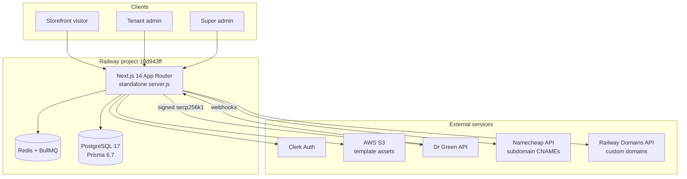
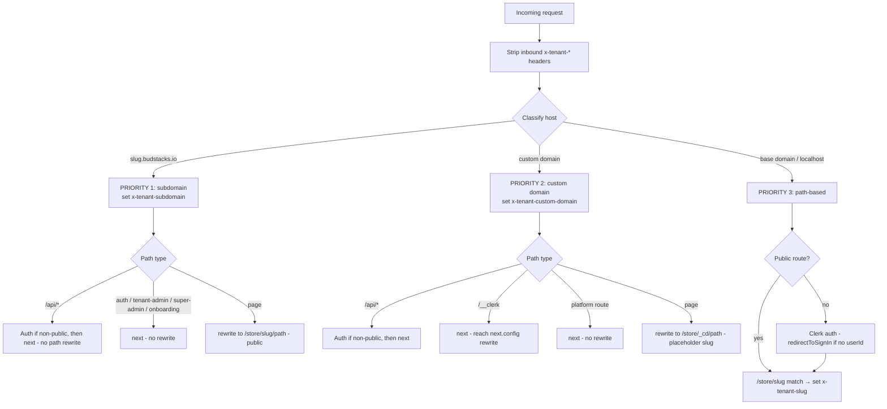
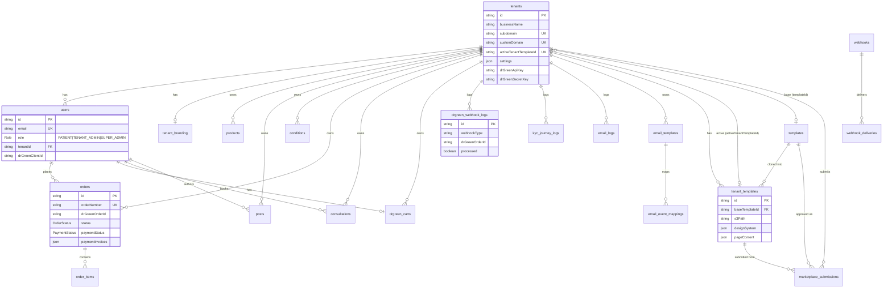
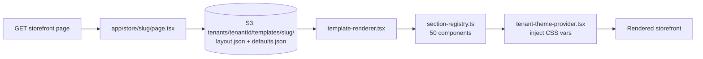
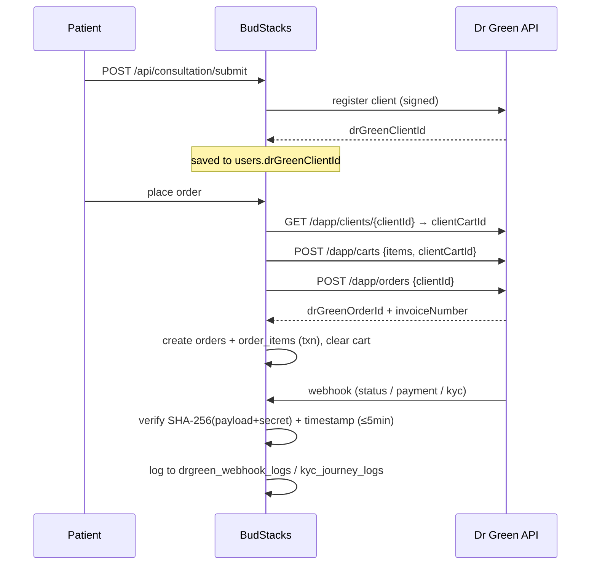
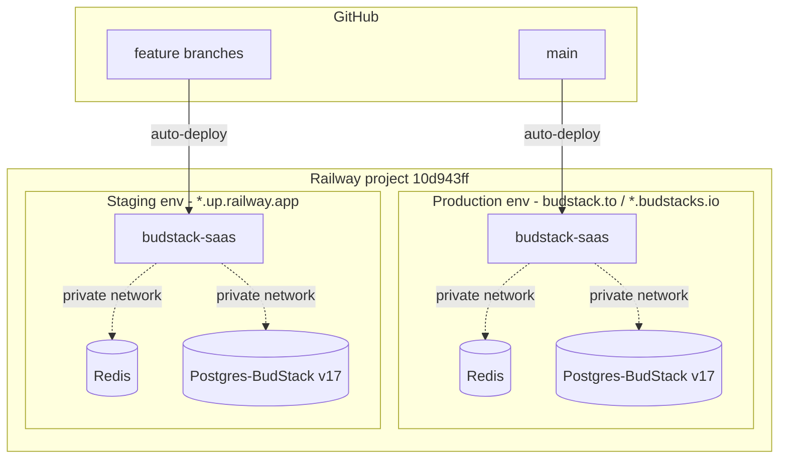

# BudStacks — System Architecture

> **Status:** Authoritative. Code-verified against `nextjs_space/` on 2026-05-29.
> Every claim below was checked against source. When code and this doc disagree, **the code wins** — fix this doc.

BudStacks is a **multi-tenant SaaS platform** that lets operators launch branded medical-cannabis storefronts. Each tenant gets a data-driven storefront (served on a subdomain or custom domain), a tenant-admin console, and an integration with the **Dr Green** prescription/fulfilment API. A super-admin tier manages tenants, templates, and platform settings.

---

## 1. Tech Stack (verified)

| Concern | Choice | Version | Source |
|---|---|---|---|
| Framework | Next.js (App Router, standalone output) | `^14.2.35` | `package.json` |
| Language | TypeScript / React | React `18.2.0` | `package.json` |
| Auth | **Clerk** (`clerkMiddleware`) | `@clerk/nextjs ^6.39.3` | `middleware.ts:1` |
| ORM / DB | Prisma + PostgreSQL | Prisma `6.7.0`, PG 17 | `schema.prisma`, Dockerfile |
| Queue / cache | BullMQ + Redis (ioredis) | `bullmq ^5.66.4`, `ioredis ^5.9.1` | `package.json` |
| Object storage | AWS S3 (template assets) | `@aws-sdk/client-s3 ^3.917.0` | `package.json` |
| Validation | Zod | `3.23.8` | `package.json` |
| Hosting | **Railway** (Docker standalone) | node:20-slim, pnpm `10.30.2` | `Dockerfile` |
| Prescriptions | Dr Green API (external) | ECDSA secp256k1 signing | `lib/drgreen-api-client.ts` |
| Subdomain DNS | Namecheap API | — | `lib/namecheap-api.ts` |
| Custom-domain DNS | Railway Domains API | — | `lib/railway-api.ts` |

> **Not used (despite legacy references in old docs):** NextAuth (auth is Clerk; `/api/auth` routes are legacy stubs left public — `middleware.ts:13`), Abacus.AI hosting (a vestigial `.abacusai.app` dev-mode string remains in `middleware.ts:95` but deployment is Railway), and any self-hosted Docker/NGINX topology.

---

## 2. System Overview

**Plane summary**

- **Storefront plane** — public, data-driven pages served from `app/store/[slug]/` (subdomain/custom-domain visitors). No login required.
- **Tenant-admin plane** — `app/tenant-admin/*`, Clerk-gated, scoped to one tenant.
- **Super-admin plane** — `app/super-admin/*`, Clerk-gated `SUPER_ADMIN` role, cross-tenant + platform config.
- **API plane** — `app/api/*` route handlers; some public (webhooks, store, onboarding, consultation), most Clerk-gated.

---

## 3. Request Lifecycle & Tenant Isolation

All routing/tenant resolution happens in `middleware.ts` **before** the Clerk auth check, in three priority bands. The resolved tenant is passed downstream via request headers (`x-tenant-subdomain`, `x-tenant-custom-domain`, `x-tenant-slug`).

**Tenant resolution & isolation notes (verified):**

- **Subdomain** → `slug.budstacks.io/foo` is *rewritten* to `/store/slug/foo`. Base domain default is `budstacks.io` (`middleware.ts:51`, overridable via `NEXT_PUBLIC_BASE_DOMAIN`).
- **Custom domain** → rewritten to `/store/_cd/foo`; `_cd` is a placeholder slug that is **never** used for DB lookups — the real tenant is resolved from the `x-tenant-custom-domain` header downstream.
- **Storefront pages are public** (`/store/(.*)` is in the public-route allowlist), which is why subdomain rewrites must run before the auth check.
- **Tenant scoping is application-level**, not DB-enforced. Most tenant-owned models carry a `tenantId` and queries filter on it. `resolveTenantIdFromClerkOrg()` (`lib/resolve-tenant-id.ts`) maps a Clerk org id → DB tenant UUID via `settings->>'clerkOrgId'`, **falling back to the first `users` row matching the email** (`findFirst({ where: { email } })`) — an unscoped fallback worth hardening (tracked in PRDS/REMEDIATION).

---

## 4. Data Model (ERD)

PostgreSQL via Prisma — **25 models** (`schema.prisma`). `tenants` is the hub; nearly every business entity cascades from it (`onDelete: Cascade`). Singletons (`platform_config`, `platform_settings`) and loosely-coupled logs (`audit_logs`, `consultation_questionnaires`, `learning_resources`) carry a `tenantId` *string* but **no FK relation** by design.

**Model groups**

- **Tenancy & identity:** `tenants`, `users`, `tenant_branding`
- **Commerce:** `orders`, `order_items`, `products`, `drgreen_carts`
- **Dr Green / clinical:** `consultations`, `consultation_questionnaires`, `drgreen_webhook_logs`, `kyc_journey_logs`
- **Templates / marketplace:** `templates`, `tenant_templates`, `marketplace_submissions`
- **Content:** `posts`, `conditions`, `learning_resources`
- **Email:** `email_templates`, `email_event_mappings`, `email_logs`
- **Platform / ops:** `platform_config`, `platform_settings`, `audit_logs`, `webhooks`, `webhook_deliveries`

**Enums:** `Role` (PATIENT / TENANT_ADMIN / SUPER_ADMIN), `OrderStatus`, `PaymentStatus`, `ConsultationStatus`, `EmailStatus`, `StrainType` (SATIVA / INDICA / HYBRID).

---

## 5. Template Rendering (data-driven from S3)

Templates are **100% data-driven** — no template-specific values are hardcoded in the platform.

- Each tenant owns a **complete copy** of its template under `tenants/{tenantId}/templates/{templateSlug}/` in S3. There is **no fallback** to a shared base path.
- A template is described by `layout.json` (section order + nav/footer component names) and `defaults.json` (logo, colours, links, CTA, section content).
- `app/store/[slug]/page.tsx` reads the layout from S3 and feeds it to `components/template-renderer.tsx`, which composes the page from `lib/section-registry.ts`.
- `lib/section-registry.ts` maps **50 section components** by name: **13 heroes, 24 content, 4 CTAs, 6 navigation, 3 footers**.
- `components/tenant-theme-provider.tsx` injects `designSystem` colours as inline CSS variables (raw HSL channels — `--tenant-color-primary: 275 70% 55%;`); components wrap them as `hsl(var(--tenant-color-primary))`. Empty/undefined colours are filtered so they don't wipe a template's own `:root` theme.

See [templates/TEMPLATE_ARCHITECTURE.md](templates/TEMPLATE_ARCHITECTURE.md) for the full template spec.

---

## 6. Dr Green Integration

External prescription/fulfilment API. **Outbound** calls are signed with **ECDSA secp256k1** (`@noble/secp256k1` + `@noble/hashes`): the payload is SHA-256 hashed then signed, sent as `x-auth-apikey` + `x-auth-signature` headers. **Inbound** webhooks are verified with a **plain `SHA-256(rawPayload + secret)`** comparison (constant-time) — *not* HMAC — matching the Dr Green reference contract (`lib/drgreen-webhook-verify.ts:44`).

**Verified specifics:**

- Order flow is **3 steps** and `clientCartId != clientId` — the cart has its own UUID (`lib/drgreen-orders.ts:1-9`).
- A user must have a real `drGreenClientId` (consultation complete) before ordering; `manual_test_`/`MOCK_` ids are rejected.
- Public consultation entry point is **`/api/consultation/submit`** (not a `/consultation` page route — that path is the storefront page).
- Inbound webhooks validate a timestamp window (±5 min) to resist replay, and enforce client-approval state transitions.

**Inbound webhook endpoints** (`app/api/webhooks/drgreen/*`):

| Endpoint | Source | Keys off | Effect |
|---|---|---|---|
| `/api/webhooks/drgreen/status` | Dr Green | `status` / `kycStatus` / `adminApproval` | KYC + order/client status; verified via `SHA-256(payload+secret)` |
| `/api/webhooks/drgreen/crypto` | CoinRemitter | `status_code`, `custom_data2` (=`drGreenOrderId`) | crypto payment → `orders.paymentStatus`; verified via `x-webhook-signature` |
| `/api/webhooks/drgreen/fiat` | Pay-Inn | `payment_id`, `custom` (=order `nonce`) | fiat payment → `orders.paymentStatus`; verified via `x-webhook-signature` |

A successful payment (`PAID`) sets `orders.status = CONFIRMED` and fires the tenant `order.confirmed` webhook; failure/expiry maps to the corresponding `PaymentStatus` enum value.

See [integrations/DR_GREEN_API_GUIDE.md](integrations/DR_GREEN_API_GUIDE.md) for endpoint-level detail and payload field tables.

---

## 7. Custom Domains & Subdomains

- **Subdomains** (`slug.budstacks.io`): CNAME records managed through the Namecheap API (`lib/namecheap-api.ts` → `getNamecheapClient`).
- **Custom domains** (tenant's own domain): provisioned on Railway via the Railway Domains API (`lib/railway-api.ts` → `addCustomDomain` / `removeCustomDomain` / `listCustomDomains`); tenant rows store the issued `railwayDomainId`.
- Routing for both is handled in `middleware.ts` (§3).

See [guides/DOMAINS.md](guides/DOMAINS.md) for the operator runbook.

---

## 8. Deployment Topology (Railway + Docker)

**Build & boot (verified `Dockerfile` + `entrypoint.sh`):**

- 3-stage Docker build on `node:20-slim`: **deps** (`pnpm install --frozen-lockfile`) → **builder** (`prisma generate`, `pnpm build`, Next.js standalone) → **runner** (non-root `nextjs:nodejs`, port 3000, healthcheck on `/api/health`).
- Boot sequence (`entrypoint.sh`): `wait-for-db` → `prisma migrate deploy` → `apply-marketplace-migrations` (idempotent) → `sync-templates-from-s3` (best-effort) → `node app/server.js`.
- Postgres/Redis are on Railway's **private network** (`postgres.railway.internal`) — not reachable from a local machine. Use Railway reference vars (`${{Postgres-BudStack.DATABASE_URL}}`, `${{Redis.REDIS_URL}}`), never hardcoded URLs.

See [runbooks/DEPLOYMENT.md](runbooks/DEPLOYMENT.md) for environment + DB-clone procedures.

---

## 9. Security Posture (known, verified)

These are accurate as of audit; remediation is tracked in [PRDS/REMEDIATION/](PRDS/REMEDIATION/REMEDIATION-INDEX.md).

- **Inbound Dr Green webhook** uses plain `SHA-256(payload+secret)` (constant-time compare) — intentional, matches the Dr Green contract; not a vulnerability but noted because it differs from the usual HMAC pattern.
- **Outbound webhook delivery** (`lib/webhook.ts:95`) does a bare `fetch(webhook.url)` with **no SSRF allowlist / private-IP filter** — tenant-supplied URLs can target internal addresses. Tracked for hardening.
- **Tenant resolution fallback** (`lib/resolve-tenant-id.ts`) does an unscoped `findFirst({ where: { email } })` — see §3.
- **Error envelopes** are inconsistent: only ~33 of ~107 API routes import `lib/api-error.ts`; the rest hand-roll `NextResponse.json({ error })`, and ~27 leak raw `error.message`.

---

## 10. Key File Map

| Path | Responsibility |
|---|---|
| `middleware.ts` | Clerk auth + 3-tier tenant routing (subdomain / custom domain / path) |
| `prisma/schema.prisma` | 25-model data model |
| `app/store/[slug]/layout.tsx` | Storefront shell — nav/footer, `TenantThemeProvider` |
| `app/store/[slug]/page.tsx` | S3 layout lookup → `TemplateRenderer` |
| `components/template-renderer.tsx` | Data-driven section composer |
| `components/tenant-theme-provider.tsx` | Inject `designSystem` as CSS variables |
| `lib/section-registry.ts` | 50 section components mapped by name |
| `lib/drgreen-api-client.ts` | secp256k1 request signing + `callDrGreenAPI` |
| `lib/drgreen-orders.ts` | 3-step order flow |
| `lib/drgreen-webhook-verify.ts` | Inbound webhook signature/timestamp/payload checks |
| `lib/railway-api.ts` | Custom-domain provisioning |
| `lib/namecheap-api.ts` | Subdomain CNAME management |
| `lib/resolve-tenant-id.ts` | Clerk org id → DB tenant UUID |
| `lib/api-error.ts` | `ApiError` / `apiError()` response helpers |
| `Dockerfile` / `entrypoint.sh` | Railway build + boot |

---

*Diagrams render natively on GitHub (Mermaid). Regenerate this doc whenever routing, the schema, the section registry, or the Dr Green flow changes.*
