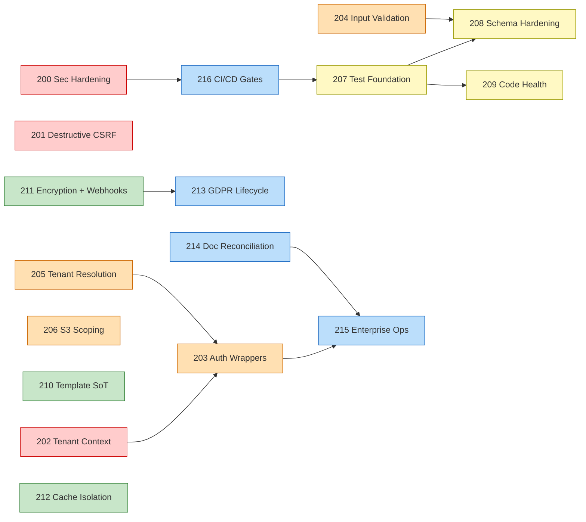

# Remediation PRD Suite — Index

> **Created:** 2026-05-29 — from the enterprise + security review of `fix/super-admin-domain-dns-recovery`.
> **Status:** Proposed — awaiting Gerard sign-off per PRD.
> **Verified:** 2026-05-29 — every checkable claim from the first-pass review was re-read against the code before kickoff (see [Pre-flight verification](#pre-flight-verification--2026-05-29)). Four findings were **down-rated** from CRITICAL after verification, one was **confirmed** CRITICAL, three were **elevated**, and one "done well" praise was **retracted as factually wrong**. No PRD now rests on a false premise.
> **Scope:** All findings raised by the five parallel agent reviews (architecture, security audit, API security audit, code quality, doc-vs-code consistency).
> **Owner of suite:** Gerard + Claude. Per-PRD owners listed in each file.

This suite converts the 2026-05-29 review findings into actionable PRDs. **Every finding is covered by at least one PRD.** No greenfield work — every PRD either closes a doc-vs-code gap, lifts an existing pattern (e.g. `withTenantAuth` wrapper, Dr Green webhook signature verifier) to a wider surface, or wires an already-designed but unbuilt control.

These remediation PRDs (PRD-200..PRD-216) sit alongside the existing build PRDs (`prd-*`). The build PRDs describe **what** to build for end-users. The remediation PRDs describe **what to fix** to honour the build PRDs' promises and close the security/architecture gaps.

---

## Why a remediation suite

The 2026-05-29 review summarised:

> "Dramatic progress since the May 1 security audit — all 14 CRITICALs closed or mitigated. But three uncomfortable truths sit underneath: (1) effective test coverage is zero on a payment + KYC platform; (2) tenant isolation is architecturally good but procedurally weak — only 11 of 107 routes use the auth wrappers; (3) the Jan 2026 architecture docs describe a system that no longer exists. The platform works for the current tenant set; the risk surface grows with every new tenant onboarded."

Each PRD below is deliberately surgical — closes a specific named gap with measurable acceptance criteria and a test plan.

---

## Pre-flight verification — 2026-05-29

The first-pass review (produced by an earlier agent pass) was re-checked **against the code, not its own comments**, before any PRD was scheduled. The headline result: **the architecture is sound and most findings are real, but four of the six original "CRITICAL"s do not survive contact with the code at that severity.** Re-rating them up front matters — scheduling two engineers against phantom criticals while the one real critical (tenant-context concurrency) waits would be the worst outcome.

### Down-rated after verification

| Original claim | Severity move | What the code actually shows |
|---|---|---|
| **C1 — Next.js 14.2.35 "middleware auth-bypass CVE unpatched"** | CRITICAL → **HIGH (hygiene)** | `CVE-2025-29927` (the middleware-bypass) was fixed in **14.2.25**; we run **14.2.35**, so it is already patched. The app uses the **App Router**, so the Pages-router bypass advisory is N/A regardless. The *real* open advisories on 14.2.35 are HIGH DoS (Server Components / HTTP request deserialization) + HIGH SSRF + LOW cache-poisoning — fixed by bumping to `15.5.x`. Worth doing, but it is dependency hygiene, **not** an open auth bypass. |
| **C2 — `env.windows-dev` "live credentials committed"** | CRITICAL → **MED-HIGH** | The file is **gitignored and never committed** (`git log --all -- env.windows-dev` is empty). It is a local-disk secret-spill risk, not a repo breach. Still must be deleted + the keys rotated (esp. `ENCRYPTION_KEY`, the master key for all tenant Dr Green signing keys) — but no secret ever entered git history. |
| **C3 — `reset-templates` "destructive GET CSRF"** | CRITICAL → **MEDIUM** | The route is `SUPER_ADMIN`-gated (`if (!user \|\| user.role !== "SUPER_ADMIN") return 401`) and Clerk's `SameSite=Lax` session cookie blunts the cross-site ``/form vector. The genuine problem is that it is **debug scaffolding** ("ONE-TIME CLEANUP ROUTE — DELETE AFTER USE") still shipped in production, and it leaks an internal `steps[]` trace. Fix = delete the route, not build a CSRF token system around it. |
| **"CI only gates on `tsc`; ESLint disabled"** | corrected | `.github/workflows/ci.yml` runs `pnpm lint` as a **separate, gating step** — lint *is* enforced in CI. (`next.config.js` only sets `ignoreDuringBuilds: true`, which suppresses lint during `next build`, not in CI.) The real CI gap is that there is **no test step at all** — see PRD-216. |

### Confirmed at CRITICAL

| Finding | Why it holds |
|---|---|
| **C4 — `setTenantContext()` cross-tenant leak under concurrency** | **Confirmed the single most important fix.** `lib/db.ts:110-159` installs a Prisma `$use` middleware that reads `getTenantContext()` and auto-scopes **every** tenant-model read/update/delete (and stamps `tenantId` on creates). That middleware is the primary isolation control *and* the safety net behind the 96 hand-rolled-auth routes — and its integrity rests entirely on `lib/tenant-context.ts` using the **deprecated `enterWith()`**, which replaces context for the whole async scope and can bleed across concurrent requests sharing a microtask queue on Railway's persistent Node process. The safe `runWithTenantContext()` already exists in the same file but is **unused**. This is PRD-202 and it is the highest-leverage item in the whole suite. |

### Elevated (under-weighted by the first pass)

| Finding | Severity | Where |
|---|---|---|
| **PHI / PII written to plaintext logs** | **HIGH (GDPR exposure)** | `app/actions/kyc-check.ts:122`, `app/api/consultation/submit/route.ts:153,208,431`, `app/tenant-admin/layout.tsx:35,52` log KYC/consultation/customer fields. On a medical-cannabis platform these are special-category data; log sinks are out of the DB encryption perimeter. → PRD-215 (structured logger + redaction), cross-ref PRD-213 (GDPR). |
| **Outbound tenant-webhook SSRF** | **HIGH** | `lib/webhook.ts:95` POSTs to tenant-supplied URLs with no egress allowlist — reachable targets include `169.254.169.254` (cloud metadata) and `*.railway.internal`. → PRD-211 (scope extended to outbound egress filtering). |
| **Monster files** | (count corrected) | The first pass said "5 files >800 LOC". Actual count is **14**. Largest: `app/tenant-admin/analytics/page.tsx` (1088), `app/api/webhooks/drgreen/status/route.ts` (857). → PRD-209. |

### Retracted praise

| "Done well" claim | Correction |
|---|---|
| *"Dr Green webhook uses HMAC verification — textbook."* | **False.** `lib/drgreen-webhook-verify.ts:32-44` is a **plain `sha256(rawPayload + secret)`**, not HMAC (the comment in the file even says "plain hash, NOT HMAC"). It is length-checked + `timingSafeEqual`-compared with a 5-minute replay window, so it is *adequate*, but it is weaker than HMAC-SHA256 and must not be described as textbook. → PRD-211 hardens it to true HMAC. |

**Lesson logged:** several controls in this codebase are *claimed* by a docstring or a variable name but only half-delivered by the behaviour (the `@deprecated setTenantContext` that is still the only one wired in; the "HMAC" that is a plain hash; the "ONE-TIME … DELETE AFTER USE" route still live). Every PRD below was written against **behaviour**, not comments.

---

## Phasing

| Phase | Window | Theme | PRDs | Gate |
|---|---|---|---|---|
| **R1** | Week 1 (now) | Pre-production blockers — tenant-context concurrency (the one true critical), local secret-spill purge, `legacyCss` XSS, debug-route removal; framework bump + CSP nonces (split to PRD-218) | PRD-200, 201, 202, 218 | **PRD-202 is the blocker** — cannot onboard a new paying tenant safely until the tenant-context leak is closed. 200 code fixes are shipped (AC-2a rotation by Gerard remains); 218 carries the deferred framework/CSP infra. |
| **R2** | Weeks 2–4 | Tenant-isolation foundation — auth wrapper rollout, input validation sweep, tenant resolution consolidation, S3 signed-URL scoping | PRD-203, 204, 205, 206 | Required before scaling beyond ~5 tenants |
| **R3** | Weeks 3–8 | Code quality & testing — test infrastructure, schema hardening, code boundaries | PRD-207, 208, 209 | Required for confident refactoring + first enterprise customer |
| **R4** | Weeks 4–6 | Template & data discipline — kill hardcoded HealingBuds branding, encryption fallback hardening, custom-domain cache fix | PRD-210, 211, 212 | Required before signing a second white-label tenant |
| **R5** | Weeks 6–12 | Customer readiness — GDPR completeness, doc reconciliation, ops runbooks, CI/CD security gates | PRD-213, 214, 215, 216 | Required for first paying enterprise customer + security questionnaire response |

Phases overlap. R1 must complete before any new tenant onboards. R2 must complete before scaling. R3+R4 must complete before signing a second tenant. R5 must complete before first paying enterprise customer.

---

## PRD index

### Phase R1 — Pre-Production Blockers

| PRD | Title | Severity | Effort | Owner |
|---|---|---|---|---|
| [**200**](./PRD-200-critical-security-hardening.md) | Security Hardening (env.windows-dev purge, error redaction, `legacyCss` XSS, email-template HTML, info-leak endpoints) — **code fixes shipped; AC-2a rotation (Gerard) remains** | HIGH | ~1 day (mostly shipped) | Gerard + Claude |
| [**201**](./PRD-201-destructive-endpoint-csrf-hardening.md) | Destructive Super-Admin Endpoint Removal & CSRF Defence-in-Depth | MEDIUM | 1 day | Gerard + Claude |
| [**202**](./PRD-202-tenant-context-concurrency-fix.md) | Tenant Context Concurrency Fix (`runWithTenantContext` rollout) | **CRITICAL** | 3 days | Gerard + Claude |
| [**218**](./PRD-218-framework-upgrade-csp-nonce-hardening.md) | Framework Upgrade & CSP Nonce Hardening (Next.js bump + `script-src` nonces) — **split from PRD-200** (AC-1/AC-1a/AC-8) | HIGH (Next advisories) | ~1 day | Gerard + Claude |

### Phase R2 — Tenant Isolation Foundation

| PRD | Title | Severity | Effort | Owner |
|---|---|---|---|---|
| [**203**](./PRD-203-auth-wrapper-migration.md) | Auth Wrapper Migration (`withTenantAuth`/`withSuperAdmin`) + CI Gate | HIGH | 5 days | Gerard + Claude |
| [**204**](./PRD-204-input-validation-sweep.md) | Input Validation Sweep (Zod everywhere, `parseUuid` helper, body caps) | HIGH | 4 days | Gerard + Claude |
| [**205**](./PRD-205-tenant-resolution-consolidation.md) | Tenant Resolution Consolidation (single canonical helper) | HIGH | 3 days | Gerard + Claude |
| [**206**](./PRD-206-s3-signed-url-tenant-scoping.md) | S3 Signed URL Tenant Scoping | HIGH | 2 days | Gerard + Claude |

### Phase R3 — Code Quality & Testing

| PRD | Title | Severity | Effort | Owner |
|---|---|---|---|---|
| [**207**](./PRD-207-test-strategy-foundation.md) | Test Strategy Foundation (Vitest + Playwright critical paths) | CRITICAL | 8 days | Gerard + Claude |
| [**208**](./PRD-208-schema-prisma-hardening.md) | Schema & Prisma Hardening (soft-delete, indexes, typed `tenant.settings`) | HIGH | 4 days | Gerard + Claude |
| [**209**](./PRD-209-code-health-boundaries.md) | Code Health & Boundaries (monster file split, `lib/` reorg, ESLint gate) | MEDIUM | 5 days | Gerard + Claude |

### Phase R4 — Template & Data Discipline

| PRD | Title | Severity | Effort | Owner |
|---|---|---|---|---|
| [**210**](./PRD-210-template-source-of-truth-restoration.md) | Template Source-of-Truth Restoration (kill `TEMPLATE_PRESETS`, remove HealingBuds hardcoding) | HIGH | 3 days | Gerard + Claude |
| [**211**](./PRD-211-encryption-webhook-hardening.md) | Encryption Fallback + Webhook Hardening (`decrypt` contract, rate-limit alert, deadline shrink) | HIGH | 2 days | Gerard + Claude |
| [**212**](./PRD-212-custom-domain-cache-isolation.md) | Custom-Domain ISR Cache Isolation Fix | HIGH | 1 day | Gerard + Claude |

### Phase R5 — Customer Readiness

| PRD | Title | Severity | Effort | Owner |
|---|---|---|---|---|
| [**213**](./PRD-213-gdpr-lifecycle-completion.md) | GDPR Lifecycle Completion (Clerk `user.deleted`, DPA click-through, audit access) | HIGH | 4 days | Gerard + Claude |
| [**214**](./PRD-214-documentation-reconciliation.md) | Documentation Reconciliation Sprint (rewrite Jan docs, sales pitch truth, audit annotation) | HIGH | 4 days | Gerard + Claude |
| [**215**](./PRD-215-enterprise-operational-readiness.md) | Enterprise Operational Readiness (status page, runbooks, SLO, rate-limit alerting) | HIGH | 6 days | Gerard + Claude |
| [**216**](./PRD-216-ci-cd-security-gates.md) | CI/CD Security Gates (Dependabot, CodeQL, secret scan, SBOM, build-time ESLint, test gate) | HIGH | 3 days | Gerard + Claude |

**Total estimated effort: ~61 engineer-days** (about 7–10 calendar weeks for a 1-dev + Claude pair, with R1 stacked in week 1).

---

## Mapping — every review finding → its PRD

### Top 12 review findings → PRDs

| # | Finding | PRD |
|---|---|---|
| 1 | **[CONFIRMED CRITICAL]** `setTenantContext()` uses deprecated `enterWith()`; Prisma `$use` middleware (`lib/db.ts:110`) depends on it → cross-tenant leak risk under concurrency | PRD-202 |
| 2 | Next.js 14.2.35 open advisories — HIGH DoS (Server Components / request deserialization) + HIGH SSRF + LOW cache-poisoning (CVE-2025-29927 middleware-bypass already patched in 14.2.25; we are clear). Bump to 15.5.x | PRD-218 _(split from PRD-200)_ |
| 3 | `env.windows-dev` on local disk with live-looking credentials (gitignored, never committed) → delete + rotate `ENCRYPTION_KEY` et al. | PRD-200 |
| 4 | `reset-templates` is SUPER_ADMIN-gated debug scaffolding still shipped ("DELETE AFTER USE") that leaks `steps[]` — remove it; add CSRF defence-in-depth to remaining destructive routes | PRD-201 |
| 5 | 96 of 107 routes hand-roll auth | PRD-203 |
| 6 | 16 routes accept `[id]`/`[slug]` without UUID validation | PRD-204 |
| 7 | 7 tenant-resolution helpers with subtly different semantics | PRD-205 |
| 8 | `signS3Path` no caller-tenant assertion | PRD-206 |
| 9 | Effective test coverage zero (1 spec that auto-skips) | PRD-207 |
| 10 | No soft-delete columns; tenant.settings as any × 35 | PRD-208 |
| 11 | Hardcoded HealingBuds branding in platform components; `TEMPLATE_PRESETS` in onboarding | PRD-210 |
| 12 | Clerk `user.deleted` no-op = GDPR violation | PRD-213 |

### All other findings → PRDs

| Finding | PRD |
|---|---|
| `legacyCss` injected via `dangerouslySetInnerHTML` without `sanitizeCss()` | PRD-200 |
| `super-admin/email-templates` POST/PUT accept raw HTML | PRD-200 |
| 27+ `error.message` leaks to client | PRD-200 |
| `RESERVED_SUBDOMAINS` not checked on super-admin tenant rename | PRD-201 |
| `_cd` placeholder not in `RESERVED_SUBDOMAINS` | PRD-201 |
| Encryption fallback silently returns ciphertext as plaintext (`allowUnencryptedMigration`) | PRD-211 |
| Encryption migration deadline `2026-12-31` too far out | PRD-211 |
| Webhook rate limiter fails open silently when Redis down | PRD-211 |
| Webhook tenant resolution runs DB query on attacker input before signature verify | PRD-211 |
| Custom-domain ISR cache collision via `/store/_cd/...` rewrite | PRD-212 |
| `getCurrentUser()` falls back to an unscoped `findFirst({where:{email}})` (`lib/resolve-tenant-id.ts:37-40`) when Clerk org→tenant resolution misses — no host/tenant scoping | PRD-203 |
| `tenant.settings` cast `as any` × 35 with no Zod validation on read | PRD-208 |
| `deepMerge(any,any):any` — no prototype-pollution filter | PRD-204 |
| Customer-profile PATCH no Zod, no length caps | PRD-204 |
| Super-admin tenants PATCH `settings` blob no strict Zod | PRD-204 |
| Audit-log entries persist sensitive `settings` snapshot | PRD-214 |
| No soft-delete columns anywhere in Prisma schema | PRD-208 |
| Missing indexes: `users.tenantId`; `orders` lacks `(tenantId, createdAt)` | PRD-208 |
| `app/tenant-admin/analytics/page.tsx` 1088 LOC; **14 files >800 LOC** (first pass under-counted as 5) | PRD-209 |
| **[ELEVATED → HIGH]** PHI/PII to plaintext logs (`app/actions/kyc-check.ts:122`, `consultation/submit/route.ts:153,208,431`, `tenant-admin/layout.tsx:35,52`) — special-category data outside encryption perimeter | PRD-215 (logger + redaction), PRD-213 (GDPR) |
| **[ELEVATED → HIGH]** Outbound tenant-webhook SSRF — `lib/webhook.ts:95` POSTs to tenant-supplied URLs with no egress allowlist (`169.254.169.254`, `*.railway.internal` reachable) | PRD-211 |
| 60+ files at top level of `lib/` with no organisation | PRD-209 |
| ESLint `ignoreDuringBuilds: true` in `next.config.js` | PRD-216 |
| CSP retains `script-src 'unsafe-inline'` (no nonces) | PRD-218 _(split from PRD-200)_ |
| Mock data imported into super-admin audit log page | PRD-209 |
| `app/api/webhooks/drgreen/status/route.ts` 857 LOC | PRD-209 |
| `app/api/consultation/submit/route.ts` 545 LOC | PRD-209 |
| `[id]` path params without UUID validation in 16 routes | PRD-204 |
| `getCurrentUser()` race with Clerk `user.created` webhook | PRD-203 |
| Audit log table has no immutability trigger / hash chain | PRD-208 |
| Hardcoded `TEMPLATE_PRESETS` in onboarding overrides S3 defaults.json | PRD-210 |
| Hardcoded HealingBuds copy in `navigation.tsx`, `footer.tsx`, `home/*.tsx` | PRD-210 |
| `template-registry.ts` claimed auto-generated but undocumented | PRD-210 |
| `AUTHENTICATION_FLOWS.md` describes NextAuth; you use Clerk | PRD-214 |
| `DOMAIN_SETUP_INSTRUCTIONS.md` describes Abacus.AI; you use Railway | PRD-214 |
| `MULTI_TENANT_ARCHITECTURE.md` defines `slug`/`TenantStatus` not in Prisma | PRD-214 |
| `SAAS_ARCHITECTURE_PLAN.md` defines NFT model that doesn't exist | PRD-214 |
| `BUDSTACK_ARCHITECTURE_AND_DEPLOYMENT.md` auth section wrong | PRD-214 |
| `SUBDOMAIN_DEPLOYMENT_STATUS.md` claims legacy React templates live | PRD-214 |
| Sales pitch "HIPAA Ready" / "5-min launch" / "Lighthouse 90+" claims | PRD-214 |
| `SECURITY_AUDIT_2026-05-01.md` not annotated with fix-commit refs | PRD-214 |
| `SUPER_ADMIN_MANUAL.md` Namecheap section vs Railway reality | PRD-214 |
| No structured logger; 839 `console.*` calls repo-wide (~450 in `app`/`lib`/`components`, 384 in one-off `scripts/`); no PII redaction in logs | PRD-215 |
| No status page; no runbooks; no SLO doc; no DR drill | PRD-215 |
| Webhook rate-limit fail-open has no alerting hook | PRD-215 |
| DPA click-through at onboarding missing (legal PRD US-001) | PRD-213 |
| Account-delete/export rate-limited but not audited centrally | PRD-213 |
| No CI test gate; no Dependabot config | PRD-216 |
| No CodeQL or secret-scan workflow | PRD-216 |
| No SBOM generation on build | PRD-216 |
| No build-time lint enforcement | PRD-216 |
| Magic numbers (rate-limits, body caps, scrypt N) scattered | PRD-209 |
| Mixed package managers (yarn lockfile gone, pnpm-lock present) | PRD-209 |
| `optionalDependencies` link to sibling `automatos-widget-sdk` repo | PRD-215 |
| `users.email` global uniqueness assumes single tenant per user | PRD-205 |
| `customer/profile` cross-tenant email leak via no-tenant findFirst | PRD-203 |
| `customer/profile` PATCH no length caps on first/last/phone/address | PRD-204 |
| `health` endpoint reveals memory+uptime to anonymous callers | PRD-200 |
| `drgreen-keys` GET leaks decoded byte length + 30-char text preview | PRD-200 |
| Only 33 of 107 routes import the `lib/api-error.ts` helper; ~85 hand-roll `NextResponse.json({ error }, …)` — no consistent error envelope (first pass called this "19 routes hand-roll `FAILURE_STATUS`"; no such symbol exists) | PRD-209 |
| Tests under `nextjs_space/tests/` skip when `PLAYWRIGHT_AUTH_STATE` unset | PRD-207 |

Every review finding is now owned by exactly one PRD (or referenced as cross-PRD when it spans).

---

## Dependency graph

Key dependencies:
- PRD-202 (tenant context) blocks PRD-203 (auth wrapper migration) — the wrapper relies on `runWithTenantContext`.
- PRD-207 (test foundation) blocks PRD-208/209 — refactor without tests is dangerous.
- PRD-211 (encryption + webhooks) blocks PRD-213 (GDPR) — encryption must be hardened before erasure flows touch the same data.
- PRD-214 (doc reconciliation) blocks PRD-215 (enterprise ops) — runbooks need a current architecture doc to reference.
- PRD-216 (CI gates) supports PRD-207 (testing) — coverage threshold + gate need to land together.

---

## Sign-off matrix

| Owner | PRDs they must sign |
|---|---|
| **Gerard (CTO/owner)** | All 17 — technical owner |
| **Legal/DPO advisor** | 213 (GDPR), 214 (sales pitch truth), 215 (DPA + sub-processor) |
| **Security advisor** | 200 (security hardening), 201 (CSRF), 211 (encryption), 216 (CI security) |

---

## Quick-wins cross-reference

The review identified ~14 quick wins. They are absorbed into PRDs as follows:

| Quick win | PRD §AC |
|---|---|
| Delete `env.windows-dev` (done) + rotate secrets (Gerard) | PRD-200 AC-2 / AC-2a |
| `pnpm add next@^15.5.16` | **PRD-218 AC-1** (split from PRD-200) |
| Wrap `legacyCss` with `sanitizeCss()` (done) | PRD-200 AC-3 |
| Sanitize super-admin email-templates HTML (done) | PRD-200 AC-4 |
| Remove `?confirm=yes` GET on reset-templates | PRD-201 AC-1 |
| Add `RESERVED_SUBDOMAINS` check on rename | PRD-201 AC-4 |
| Wrap path-param routes in `parseUuid()` | PRD-204 AC-1 |
| Apply `withTenantAuth`/`withSuperAdmin` everywhere | PRD-203 AC-1 |
| Route `error.message` returns through `apiError()` (client leak closed; envelope sweep partial) | PRD-200 AC-5 |
| Add `(tenantId, createdAt)` index on `orders`; `tenantId` on `users` | PRD-208 AC-4 |
| Wire Clerk `user.deleted` to delete handler | PRD-213 AC-1 |
| Enable ESLint `ignoreDuringBuilds: false` | PRD-216 AC-3 |
| Add Dependabot config | PRD-216 AC-1 |
| Replace `setTenantContext` with `runWithTenantContext` | PRD-202 AC-1 |

---

## Workflow (same as build PRDs)

1. **Draft** — PRD lands as `Proposed`.
2. **Review** — Named sign-off owner per row above acks acceptance criteria + open questions.
3. **TDD seeds** — Test specs from §4 + §12 written before implementation.
4. **Build** — Feature branch, scoped to one PRD.
5. **PR** — Lint + typecheck + tests + 80% coverage (95% on security-critical modules); code-reviewer agent runs; Gerard merges.
6. **Merge** — to `main`. PRD updated to `Shipped`. Cross-reference closed findings into the suite-level changelog.
7. **Post-ship** — Success metric tracked; remediation closes when the original review finding can be re-verified as "no longer present."

---

## See also

- The five agent review outputs (synthesised in the 2026-05-29 chat transcript with Claude).
- [`../../archive/prd-security-remediation.md`](../../archive/prd-security-remediation.md) — May 2026 phased fix plan; the foundation this suite builds on (archived 2026-05-29).
- [`../../archive/prd-codebase-health.md`](../../archive/prd-codebase-health.md) — codebase-health baseline (archived 2026-05-29). **Coverage gap:** its Phase 3 (performance — N+1 queries, skeletons, revalidation, Suspense) and Phase 4 (build — unused deps, Railway build caching, framer-motion) are **not** yet adopted into any numbered PRD here; that archived doc is their only spec. A future PRD-217 (performance & build) should claim them. _(Note on numbering: PRD-217 remains the open slot for performance & build; **PRD-218** is already taken — it is the framework-upgrade + CSP-nonce slice split out of PRD-200.)_
- [`../../archive/SECURITY_AUDIT_2026-05-01.md`](../../archive/SECURITY_AUDIT_2026-05-01.md) — most recent third-party-style audit (archived).

---

## Addendum — 2026-07-10 CX review additions (R6)

The 2026-07-10 CX/enterprise-readiness review (triggered by the first hands-on new-tenant setup, 2026-07-09) added a second wave of remediation PRDs. Unlike the 2026-05-29 suite these are **customer-experience-first, security explicitly out of scope** (Gerard's framing). Numbering: **219–224 reserved** for this wave (2xx = remediation); its growth counterparts live at top level (`../PRD-305`…`PRD-307` reserved).

### Phase R6 — CX Review 2026-07-10

| PRD | Title | Severity | Effort | Owner |
|---|---|---|---|---|
| [**219**](./PRD-219-admin-fulfilment-bug-cluster.md) | Admin & Storefront Fulfilment Bug Cluster (Prisma relation names) — webhooks page dead, customer order-detail 500 + dead PAID-sync. Scope already reduced by PR #187 (admin order-status PATCH, merged 2026-07-09) | HIGH | 0.5 day | Gerard + Claude |
| [**220**](./PRD-220-silent-failure-cluster.md) | Silent-Failure Cluster: email pipeline (BullMQ worker deployment unverified — nothing in repo starts it), ID-upload swallow, image signed-URL persistence/expiry | HIGH | 2–3 days | Gerard + Claude |
| 221–224 | _Reserved_ — remaining items from the 2026-07-10 review's 10-PRD list (delivered in chat; to be filed as they are re-derived/prioritised) | — | — | — |

Related decisions recorded 2026-07-10 (billing): **PRD-303 stays** (plans/gating) but its schema must be **provider-independent (de-Striped)**; a new top-level **PRD-307** owns the payment-provider integration behind a swappable interface — cannabis-adjacency rules out merchant-of-record providers (Lemon Squeezy/Paddle prohibit), so a high-risk merchant account path is being evaluated (PayCloud question open with Gerard).

---

## Changelog

| Version | Date | Author | Changes |
|---|---|---|---|
| 0.1 | 2026-05-29 | Claude (with Gerard) | Initial draft. 17 PRDs covering all 2026-05-29 review findings. |
| 0.2 | 2026-05-29 | Claude (Opus 4.8 verification pass) | Pre-flight code verification of every checkable claim. Down-rated PRD-200 (CRITICAL→HIGH) and PRD-201 (CRITICAL→MEDIUM); confirmed PRD-202 CRITICAL (Prisma `$use` middleware depends on the leaky `enterWith()`); elevated PHI-in-logs + outbound webhook SSRF to HIGH; corrected monster-file count (5→14); retracted the false "HMAC" praise (it is a plain SHA-256). Added "Pre-flight verification" section. Re-ordered top-findings so the one true critical leads. |
| 0.3 | 2026-05-29 | Claude (Opus 4.8) | **PRD-200 split + status reconciled with shipped code.** Added **PRD-218** (framework upgrade + CSP nonces, AC-1/AC-1a/AC-8 lifted from PRD-200) to the R1 index + phasing table. Re-pointed findings #2 (Next.js) and CSP to PRD-218. Corrected the scrambled quick-wins AC numbers (PRD-200 secret-purge AC-1→AC-2/2a, Next AC-2→PRD-218 AC-1, legacyCss AC-5→AC-3, email AC-6→AC-4, apiError AC-7→AC-5) and flagged which are shipped. Noted PRD-217 still reserved for performance & build. |
| 0.3 | 2026-05-29 | Claude (Opus 4.8 reconciliation) | Count/path reconciliation across index + PRDs: `console.*` 437→839 repo-wide (~450 in app/lib/components, 384 in `scripts/`); `tenant.settings as any` 27→35 (across 34 lines); replaced the unverifiable "19 routes hand-roll `FAILURE_STATUS`" (no such symbol) with the real "33 of 107 routes import `lib/api-error.ts`; ~85 hand-roll `NextResponse.json({ error })`"; fixed all `lib/api-response.ts`→`lib/api-error.ts` (module never existed); refined `getCurrentUser()` "email only"→unscoped `findFirst({where:{email}})` fallback (`lib/resolve-tenant-id.ts:37-40`); fixed PRD-211 decrypt fail-open line `:134`→`:135`. Spot-verified PRD-207/211 code anchors against source (all line-accurate). |
| 0.4 | 2026-07-10 | Claude (with Gerard) | Added **R6 addendum** — 2026-07-10 CX review wave: PRD-219 (fulfilment relation-name bugs; scope net of merged PR #187) + PRD-220 (silent-failure cluster: email worker, ID-upload swallow, image URLs); 221–224 reserved. Recorded the billing split decision (PRD-303 de-Striped, PRD-307 owns provider integration). |
