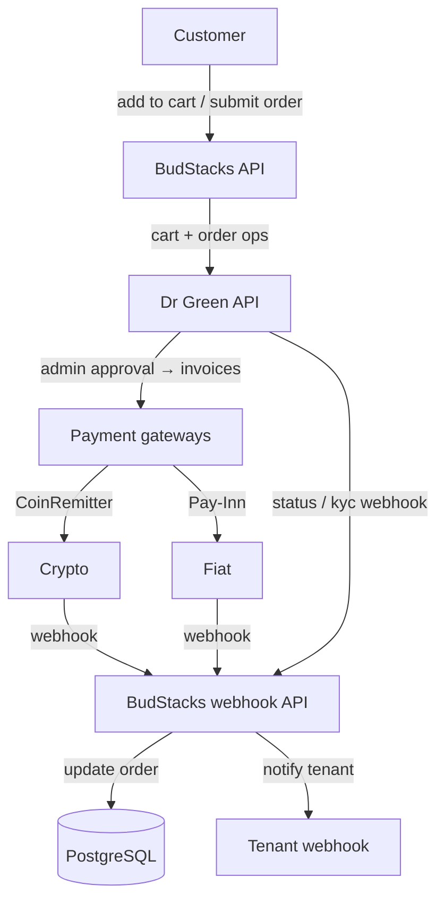

# Dr Green dApp API — Complete Integration Guide

## Base URL
```
https://api.drgreennft.com/api/v1
```

## Authentication (EVERY request)
Every request requires two headers:
```
x-auth-apikey: <your-api-key>
x-auth-signature: <ECDSA-secp256k1-signature>
```

**Signing rules:**
- **POST / PATCH / DELETE** → sign the JSON body string (`JSON.stringify(body)`)
- **GET with query params** → sign the query string (e.g. `take=200&page=1&orderBy=desc`)
- **GET without query params** → sign a JSON body that is NOT sent in the request but used only for signature (passed as a separate `signBody` parameter)

The signature is **ECDSA secp256k1** — SHA-256 hash of the payload, signed with your private key, output as **DER-encoded base64**. The private key is provided as a base64-encoded PKCS#8 or SEC1 DER blob.

---

## Key Concept: clientId vs clientCartId

**This is the #1 gotcha.** They are different UUIDs:

| Field | What it is | Where you get it |
|---|---|---|
| `clientId` | The patient/client UUID | Returned when you register a client (`POST /dapp/clients/`) or stored in your DB |
| `clientCartId` | The cart's own UUID | Retrieved from the client profile: `GET /dapp/clients/{clientId}` → `response.data.clientCart[0].id` |

**`clientCartId != clientId`** — using `clientId` where `clientCartId` is expected will cause silent failures or 400 errors.

---

## Complete Order Flow

### Step 0: Get the clientCartId from client profile
```
GET /dapp/clients/{clientId}
Sign: {"clientId": "<client-uuid>"}  (signBody — NOT sent as request body)
```
Response:
```json
{
  "data": {
    "id": "<clientId>",
    "firstName": "...",
    "clientCart": [
      {
        "id": "<clientCartId>",
        "cartItems": [...]
      }
    ]
  }
}
```
Extract: `response.data.clientCart[0].id`

**Known issue:** `GET /dapp/clients/{clientId}` sometimes returns 401. Fallback: list all clients via `GET /dapp/clients?take=200&page=1&orderBy=desc` (sign the query string), then filter the array to find your client by `id`.

### Step 1: Add items to cart
```
POST /dapp/carts
Sign: the JSON body
```
Body:
```json
{
  "items": [
    { "strainId": "<product-uuid>", "quantity": 10 }
  ],
  "clientCartId": "<clientCartId-from-step-0>"
}
```
- `strainId` = the product/strain UUID
- `quantity` = total grams (e.g. 2 units × 5g = quantity 10)
- `clientCartId` = the cart UUID from Step 0, **NOT the clientId**

### Step 2: Place order
```
POST /dapp/orders
Sign: the JSON body
```
Body:
```json
{
  "clientId": "<client-uuid>"
}
```
- Here you use the actual `clientId` (not clientCartId)
- Dr Green converts the current cart into an order server-side

Response includes `data.id` (the order UUID) and `data.invoiceNumber`.

---

## Other Endpoints

### Register a new client
```
POST /dapp/clients/
Sign: the JSON body
```
Body:
```json
{
  "firstName": "...",
  "lastName": "...",
  "email": "...",
  "phoneCode": "+27",
  "phoneCountryCode": "ZA",
  "contactNumber": "123456789",
  "shipping": {
    "address1": "...",
    "city": "...",
    "state": "...",
    "country": "South Africa",
    "countryCode": "ZA",
    "postalCode": "..."
  },
  "medicalRecord": {
    "dob": "1990-01-01",
    "gender": "Male",
    "medicalConditions": ["..."],
    "medicalHistory0": false,
    "medicalHistory1": false,
    "medicalHistory2": false,
    "medicalHistory3": false,
    "medicalHistory4": false,
    "medicalHistory5": [],
    "medicalHistory8": false,
    "medicalHistory9": false,
    "medicalHistory10": false,
    "medicalHistory12": false,
    "medicalHistory13": "",
    "medicalHistory14": []
  }
}
```
Returns: `{ data: { clientId: "<uuid>", kycLink: "..." } }`

### Update client profile
```
PATCH /dapp/clients/{clientId}
Sign: the JSON body
```
Body (partial — only include fields you're changing):
```json
{
  "firstName": "...",
  "lastName": "...",
  "email": "new@email.com",
  "phoneCode": "+27",
  "contactNumber": "..."
}
```

### List clients (paginated)
```
GET /dapp/clients?take=200&page=1&orderBy=desc
Sign: the query string "take=200&page=1&orderBy=desc"
```
Response shape varies — check for: `response.data.clients`, `response.data.data`, `response.data.items`, or `response.data` as array.

### Get products/strains
```
GET /strains?countryCode=ZAF&orderBy=desc&take=100&page=1
Sign: the query string
```
- `countryCode` uses **ISO 3166-1 alpha-3** (ZAF, PRT, GBR — not ZA, PT, GB)
- Prices returned in EUR — convert client-side

### Get cart
```
GET /dapp/carts?orderBy=desc&take=10&page=1&clientId=<client-uuid>
Sign: the query string
```

### Remove item from cart
```
DELETE /dapp/carts/{cartId}?strainId=<strain-uuid>
Sign: {"cartId": "<cartId>"}
```

### Delete entire cart
```
DELETE /dapp/carts/{cartId}
Sign: {"cartId": "<cartId>"}
```

### Get orders
```
GET /dapp/client/{clientId}/orders
Sign: {"clientId": "<client-uuid>"}  (signBody)
```

### Get single order
```
GET /dapp/orders/{orderId}
Sign: {"orderId": "<order-uuid>"}  (signBody)
```

---

## Common Pitfalls

1. **Using clientId instead of clientCartId in `POST /dapp/carts`** — this was our biggest bug. Cart operations need the cart's own UUID.
2. **GET /dapp/clients/{id} returns 401** — known API limitation. Use the list-and-filter fallback.
3. **Response nesting varies** — some endpoints return `{data: {data: {...}}}`, others `{data: {...}}`. Always check multiple levels.
4. **Country codes for strains use alpha-3** (ZAF, PRT, GBR) not alpha-2 (ZA, PT, GB).
5. **Signing GET requests with no query params** — you still need to sign something. Pass a JSON body as `signBody` for signature generation, but don't include it in the actual HTTP request.

---

## Inbound Webhooks & Payments

BudStacks receives three inbound webhooks (verified handlers under `app/api/webhooks/drgreen/`). After an order is placed it sits `PENDING` until admin approval, after which Dr Green generates payment invoices and the payment gateways call back.



### Status webhook — `POST /api/webhooks/drgreen/status`

Dr Green client/order/KYC status. Verified via **`SHA-256(rawPayload + secret)`** (plain hash, constant-time — *not* HMAC), timestamp window ±5 min. Fields are **flat** (top-level), not nested in `data`: `event`, `timestamp`, `clientId?`, `orderId?`, `status?`, `paymentStatus?`, `kycStatus?`, `adminApproval?`, `rejectionReason?`, `kycLink?`, `stock?`, `availability?`, `countryCode?`. Logged to `drgreen_webhook_logs` / `kyc_journey_logs`.

### Crypto payment — `POST /api/webhooks/drgreen/crypto` (CoinRemitter)

Verified via the `x-webhook-signature` header against the tenant `drGreenSecretKey`.

| Field | Meaning |
|---|---|
| `invoice_id` | CoinRemitter invoice → stored as `drGreenInvoiceNum` |
| `status_code` | `0`=Pending, `1`=Paid, `2`=Overpaid, `3`=Underpaid, `4`=Expired, `5`=Cancelled |
| `coin` | USDT / ETH / BTC / TCN (testnet) |
| `usd_amount` | USD amount |
| `address` | crypto address |
| `custom_data2` | **Dr Green Order ID → order lookup key** |
| `timestamp` / `created_at` | replay protection |

### Fiat payment — `POST /api/webhooks/drgreen/fiat` (Pay-Inn)

Verified via the `x-webhook-signature` header.

| Field | Meaning |
|---|---|
| `payment_id` | Pay-Inn payment → stored as `drGreenInvoiceNum` |
| `status` | `OK` / `FAILED` |
| `code` | `200` = success; `>=400` = failure |
| `amount` / `currency` | amount (currency defaults `USD`) |
| `custom` | **order `nonce` → order lookup key** (cleared after processing) |
| `timestamp` / `created_at` | replay protection |

**Status mapping (both gateways):** a paid result sets `orders.paymentStatus = PAID` and `orders.status = CONFIRMED` and fires the tenant `order.confirmed` webhook; failure/expiry maps to the matching `PaymentStatus` enum value (and fires `order.cancelled` on hard failure).
